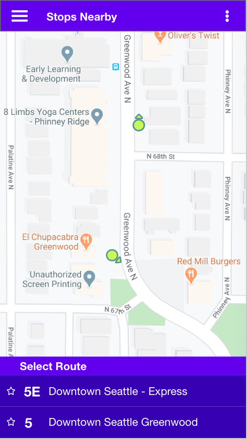
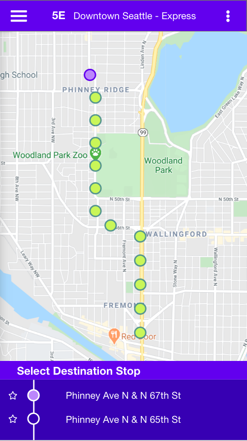
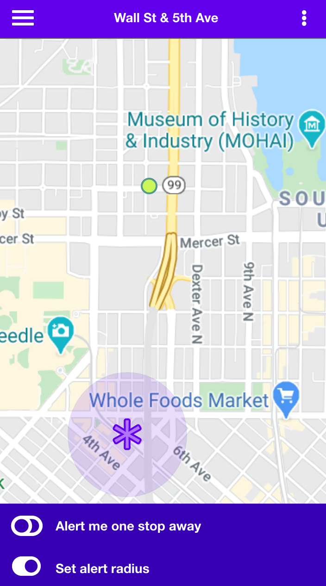

# Stop Watch
## Description:
An Android app that alerts bus commuters when they are close to their stop.

## Built With:
- [Java](https://www.java.com/en/)
- [Gradle](https://gradle.org/)
- [AWS Amplify](https://aws.amazon.com/amplify/)
- [Google Maps Embedded API](https://developers.google.com/maps/documentation/embed/start)
- [OneBusAway RESTful API](http://developer.onebusaway.org/modules/onebusaway-application-modules/1.1.14/api/where/index.html)

## Our Team:
- Ellen Conley
- Hai Le
- Ran Vaknin

## Wireframes:

### Select Route

### Select Destination Stop

### Set Approaching Destination Alert

